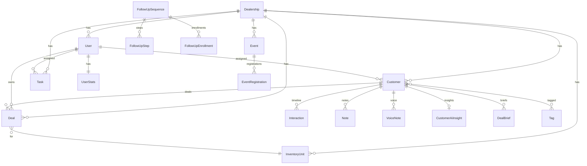

# Forge — Database ERD

## Core Indexes

- `customers(dealershipId, deletedAt)` + trigram on name/email/phone
- `inventory_units(dealershipId, status, make, model)`
- `deals(dealershipId, stage)`
- `notes.embedding` — pgvector HNSW index
- `tasks(dealershipId, assignedToId, status, dueAt)`
